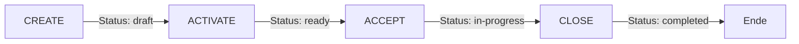

# E-Rezept Workflow - Testanleitung

## Übersicht
Diese Anleitung beschreibt, wie der komplette E-Rezept Workflow (CREATE → ACTIVATE → ACCEPT → CLOSE) lokal getestet werden kann.

## Voraussetzungen

### 1. Docker Container starten
Stelle sicher, dass alle benötigten Container laufen:

```bash
docker-compose up -d
```

Überprüfe, ob alle Container laufen:
```bash
docker ps
```

Folgende Container sollten aktiv sein:
- **PostgreSQL** (Port 5432) - Datenbank
- **IDP-Server** (Port 10000) - Identity Provider für JWT Tokens
- **ERP-Service** (Port 3001) - Bundle-Signierung und Token-Generation
- **Fachdienst-Tool** (Port 8083) - KBV-Bundle Signierung
- **Adminer** (Port 8082) - Datenbank-UI (optional)

### 2. HAPI FHIR Server starten
```bash
# Mit lokaler Konfiguration (application-local.yaml)
SPRING_CONFIG_LOCATION=file:./application-local.yaml mvn spring-boot:run -Dspring.profiles.active=local
```

⏱️ **Wichtig**: Warte 15-20 Sekunden bis der Server vollständig gestartet ist.

Server-Status prüfen:
```bash
curl http://localhost:8080/fhir/metadata | head -5
```

## Workflow-Tests ausführen

### 🚀 Option 1: Automatischer Kompletttest (Empfohlen)

Der einfachste Weg, den kompletten Workflow zu testen:

```bash
./test-complete-workflow.sh
```

Dieser Test führt automatisch alle 4 Operationen durch:
1. **CREATE** → Task mit Status `draft`
2. **ACTIVATE** → Task mit Status `ready` (mit automatisch signiertem KBV-Bundle)
3. **ACCEPT** → Task mit Status `in-progress`
4. **CLOSE** → Task mit Status `completed` (mit MedicationDispense)

**Erwartete Ausgabe:**
```
===========================================
E-REZEPT KOMPLETTER WORKFLOW TEST
===========================================

1. CREATE Operation
   Token Arzt erhalten
   ✓ Task erstellt: 160.000.000.000.000.00.01

2. ACTIVATE Operation
   ✓ Task aktiviert - Status: ready

3. ACCEPT Operation
   Token Apotheke erhalten
   ✓ Task akzeptiert - Status: in-progress
   Secret: 6ddd5a1fcfabffe8fc9f...

4. CLOSE Operation
   ✓ Task abgeschlossen - Receipt erstellt

===========================================
WORKFLOW ERFOLGREICH ABGESCHLOSSEN!
===========================================
Zusammenfassung:
  Prescription ID: 160.000.000.000.000.00.01
  CREATE  → Status: draft
  ACTIVATE → Status: ready
  ACCEPT  → Status: in-progress
  CLOSE   → Status: completed
===========================================
```

### 📝 Option 2: Einzelne Test-Skripte

#### CREATE und ACTIVATE testen:
```bash
./test-workflow.sh
```
Testet die Erstellung und Aktivierung eines E-Rezepts.

#### ACCEPT Operation testen:
```bash
./test-accept.sh
```
Testet die komplette Kette: CREATE → ACTIVATE → ACCEPT

### 🔧 Option 3: Manuelle Tests mit curl

Für detaillierte Kontrolle über jeden Schritt:

#### Schritt 1: Access Tokens holen
```bash
# Token für Arzt (CREATE/ACTIVATE)
TOKEN_ARZT=$(curl -s -k "https://localhost:3001/getIdpToken?healthcards=SMCB_KRANKENHAUS" | jq -r '.accessToken')
echo "Arzt-Token: ${TOKEN_ARZT:0:50}..."

# Token für Apotheke (ACCEPT/CLOSE)
TOKEN_APOTHEKE=$(curl -s -k "https://localhost:3001/getIdpToken?healthcards=SMCB_APOTHEKE" | jq -r '.accessToken')
echo "Apotheke-Token: ${TOKEN_APOTHEKE:0:50}..."
```

#### Schritt 2: CREATE Operation
```bash
RESPONSE=$(curl -s -X POST "http://localhost:8080/fhir/Task/\$create" \
  -H "Authorization: Bearer $TOKEN_ARZT" \
  -H "Content-Type: application/fhir+json" \
  -d '{
    "resourceType": "Parameters",
    "parameter": [{
      "name": "workflowType",
      "valueCoding": {
        "system": "https://gematik.de/fhir/erp/CodeSystem/GEM_ERP_CS_FlowType",
        "code": "160"
      }
    }]
  }')

# Extrahiere wichtige Daten
PRESCRIPTION_ID=$(echo "$RESPONSE" | jq -r '.parameter[0].resource.id')
ACCESS_CODE=$(echo "$RESPONSE" | jq -r '.parameter[0].resource.identifier[] | select(.system=="https://gematik.de/fhir/erp/NamingSystem/GEM_ERP_NS_AccessCode") | .value')

echo "Prescription ID: $PRESCRIPTION_ID"
echo "Access Code: $ACCESS_CODE"
```

#### Schritt 3: ACTIVATE Operation
Für ACTIVATE wird ein signiertes KBV-Bundle benötigt. Nutze das Test-Skript oder erstelle manuell ein Bundle.

#### Schritt 4: ACCEPT Operation
```bash
# AccessCode kann als Query-Parameter "ac" oder im Header "X-AccessCode" übergeben werden
ACCEPT_RESPONSE=$(curl -s -X POST "http://localhost:8080/fhir/Task/$PRESCRIPTION_ID/\$accept?ac=$ACCESS_CODE" \
  -H "Authorization: Bearer $TOKEN_APOTHEKE")

# Secret extrahieren
SECRET=$(echo "$ACCEPT_RESPONSE" | jq -r '.entry[0].resource.identifier[] | select(.system=="https://gematik.de/fhir/erp/NamingSystem/GEM_ERP_NS_Secret") | .value')
echo "Secret: $SECRET"
```

#### Schritt 5: CLOSE Operation
```bash
# Secret kann als Query-Parameter "secret" ODER im Header "X-Secret" übergeben werden.
# Die Abgabedaten müssen als Parameters-Struktur im Parameter "rxDispensation" gesendet werden.
CLOSE_PARAMS='{
  "resourceType": "Parameters",
  "parameter": [
    {
      "name": "rxDispensation",
      "resource": {
        "resourceType": "Parameters",
        "parameter": [
          {
            "name": "medicationDispense",
            "resource": {
              "resourceType": "MedicationDispense",
              "status": "completed",
              "medicationCodeableConcept": {
                "coding": [{
                  "system": "http://fhir.de/CodeSystem/ifa/pzn",
                  "code": "06313728"
                }],
                "text": "Sumatriptan-1A Pharma 100 mg Tabletten"
              },
              "subject": {
                "identifier": {
                  "system": "http://fhir.de/sid/gkv/kvid-10",
                  "value": "S040464113"
                }
              },
              "quantity": {
                "value": 1,
                "system": "http://unitsofmeasure.org",
                "code": "{Package}"
              },
              "whenHandedOver": "'$(date -u +%Y-%m-%dT%H:%M:%SZ)'"
            }
          }
        ]
      }
    }
  ]
}'

curl -s -X POST "http://localhost:8080/fhir/Task/$PRESCRIPTION_ID/\$close" \
  -H "Authorization: Bearer $TOKEN_APOTHEKE" \
  -H "X-Secret: $SECRET" \
  -H "Content-Type: application/fhir+json" \
  -d "$CLOSE_PARAMS"
```

## 🐛 Troubleshooting

### Problem: Server läuft nicht
```bash
# Server stoppen
pkill -f "spring-boot:run"

# Neu starten mit lokaler Konfiguration
SPRING_CONFIG_LOCATION=file:./application-local.yaml mvn spring-boot:run -Dspring.profiles.active=local
```

### Problem: Docker Container läuft nicht
```bash
# Container-Status prüfen
docker ps -a

# Container neu starten
docker-compose restart

# Logs prüfen
docker logs erp-service
docker logs idp-server
```

### Problem: Validierungsfehler
- In der lokalen Umgebung werden bekannte Validator-Probleme (veraltete Profile/Extensions) als WARNINGS behandelt. Siehe `VALIDIERUNGS-PROBLEME.md`
- **MedicationDispense Profil-Validierung**: Temporär relaxed für Tests. Siehe `MEDICATIONDISPENSE-PROFIL-VALIDIERUNG.md` für Details
- Für Produktion bitte Abschnitt „Permanente Lösung" in beiden Dokumenten beachten

### Logs einsehen
```bash
# Server-Logs (live)
tail -f /tmp/server.log

# Docker Container Logs
docker logs -f erp-service
docker logs -f idp-server

# PostgreSQL Datenbank prüfen
# Browser öffnen: http://localhost:8082
# System: PostgreSQL
# Server: hapi-fhir-postgres
# Username: admin
# Password: admin
# Database: hapi
```

## 📁 Wichtige Dateien

### Test-Skripte
- `test-complete-workflow.sh` - Kompletter Workflow-Test (inkl. korrekter CLOSE-Parameters-Struktur)
- `test-workflow.sh` - CREATE und ACTIVATE Test
- `test-accept.sh` - ACCEPT Operation Test

### Konfiguration
- `docker-compose.yml` - Docker Container Setup
- `application-local.yaml` - Lokale Server-Konfiguration (für Testumgebung)
- `src/main/resources/application.yaml` - Standard Server-Konfiguration
- `JWT-VALIDIERUNG-ÄNDERUNGEN.md` - JWT-Konfigurationsänderungen

### Dokumentation
- `e-rezept-workflow-guide/README.md` - Detaillierte API-Dokumentation
- `WORKFLOW-TEST-ERGEBNISSE.md` - Test-Ergebnisse und Status
- `VALIDIERUNGS-PROBLEME.md` - Bekannte Validierungsprobleme und Lösungswege
- `MEDICATIONDISPENSE-PROFIL-VALIDIERUNG.md` - Details zur MedicationDispense-Validierung

## ⚠️ Wichtige Hinweise

### Lokale Test-Umgebung
- **JWT-Validierung**: Aktiv mit dynamischem Issuer aus Discovery Document
- **Extension/Slicing-Validierung**: Bekannte Fehler aus veralteten Validator-Profilen werden im `CustomValidator` als Warnungen behandelt
- **MedicationDispense-Validierung**: Temporär relaxed (akzeptiert MedicationDispense ohne gematik-Profil)
- **Response-Validierung**: Deaktiviert für Operations (`responses_enabled: false`)
- **Datenbank**: PostgreSQL (Port 5432, persistent)

### Für Produktion
1. MedicationDispense-Profil-Validierung wieder strikt machen (siehe `MEDICATIONDISPENSE-PROFIL-VALIDIERUNG.md`)
2. Gematik Reference Validator Libraries auf neuere Version aktualisieren (siehe `VALIDIERUNGS-PROBLEME.md`)
3. Response-Validierung wieder aktivieren nach Profil-Update
4. Echte Zertifikate und TSL-Validierung aktivieren

## 🎯 Workflow-Übersicht



### Status-Übergänge
1. **CREATE**: Neuer Task → Status `draft`
2. **ACTIVATE**: Signiertes Bundle hinzufügen → Status `ready`
3. **ACCEPT**: Apotheke übernimmt → Status `in-progress`
4. **CLOSE**: Abgabe dokumentieren → Status `completed`

## 💡 Tipps

- Nutze `jq` für JSON-Formatierung: `curl ... | jq .`
- Speichere Tokens in Variablen für wiederholte Tests
- Die Prescription-ID ist gleichzeitig die Task-ID
- Access Code und Secret sind 64-stellige Hex-Strings
- Alle Operationen benötigen gültige Bearer Tokens

## 🆘 Support

Bei Problemen:
1. Prüfe die Logs (`tail -f /tmp/server.log`)
2. Stelle sicher, dass alle Docker Container laufen
3. Überprüfe die JWT-Token (müssen gültig sein)
4. Konsultiere die Dokumentation in `/e-rezept-workflow-guide/`

---

**Viel Erfolg beim Testen des E-Rezept Workflows!** 🚀